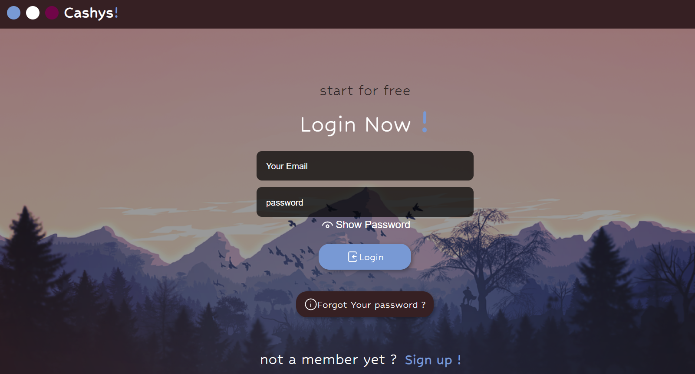
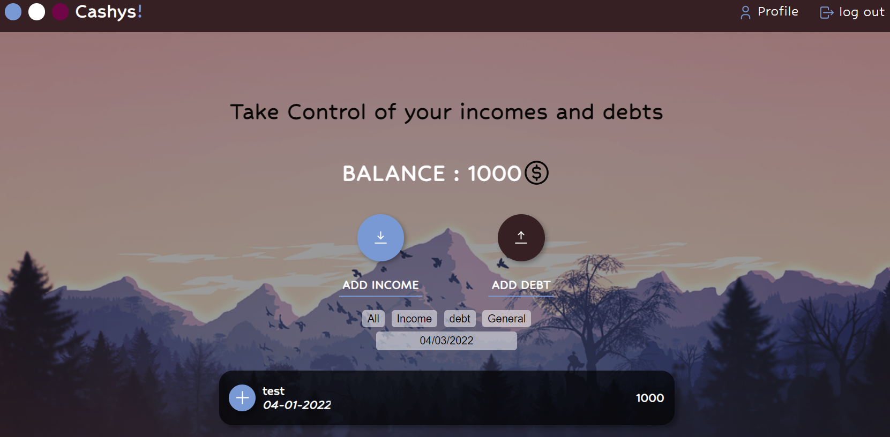
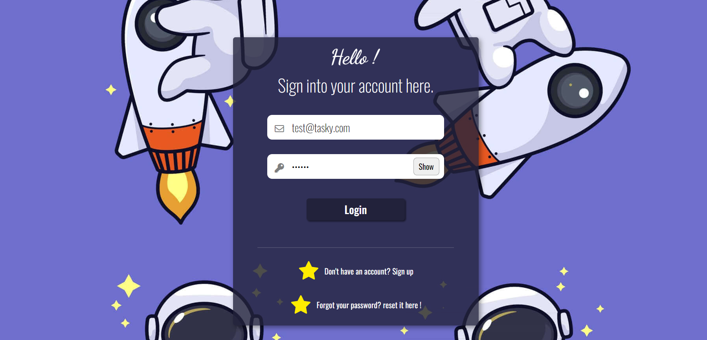
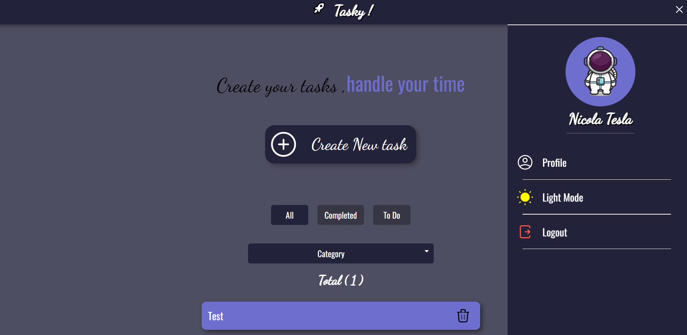

<h1 style="color:green" align="center"> Hello Cowboy !!😄😁</h1>

<h2 align="center">A passionate <b>full stack MERN developer</b>
</h2>

Hi ! my Name is Diego , I am young boy in love with _coding💻🧑‍_ , _technology 🖥️_ and _science 🔭🔬_ , I am Curious about everything that is new or unknown for me, passionate and dedicated with every single simple thing I do everyday , an _eternal learner_ and _human after all_.

At the moment I really feel happy working with Javascript in both front-end and backend with the **MERN(Mongo DB , Express js , React js , Node) stack.**

Instead of calling me a programmer I preffer to call me **a problem solver**⚒️🧮📱 .

🧑‍🚀📚I am interested in learning **PostgreSQL , Typescript , Next js and nest**

Behind the courtains I spend my time reading , drinking good hot coffee and studying Biology At the _University of Buenos Aires_.

 
 

<h2 align="center">Recent Personal Projects :</h2>

<h2 align="center">Cashys</h2>

 
 

 
 
This project has been create with **react, zustand(global state) , React Router dom v6 and toastify** 
for the **_front-end_** and for the **_back-end_** has been built with **Node js ,Express ,Sequelize as ORM  and JWT**

[ _Go to the demo_ ](https://cashys.netlify.app/)
[ _Go to Repository_ ](https://github.com/dijevic/cashys-front-end)

<h2 align="center">Taskys</h2>

 
 

 
 
This project has been create with **react, React-Redux & Redux(global state) , React Router dom v5 , sweet alert and react-alert for notifications** for the *front-end* and for the *back-end* has been built with **Node js ,Express ,Sequelize as ORM  and JWT**

[ _Go to the demo_ ](https://taskys.netlify.app/)
[ _Go to Repository_ ](https://github.com/dijevic/Tasky)

 

<h2 align="center">Languages , frameworks, libraries and Tools:</h2>

<h4>Front-end</h4>
 
 

 

<h4>Backend</h4>
 
 

<h4>Tools</h4>
 

 

 

 

 

<h2 align="center">Let's get in touch !</h2>

- 📫📩 You can reach me by **Email** if necessary : **dijevic.developer@gmail.com**
- 🔎🔎 Connect with me on **linkedIn** : [_go to LinkedIn !_](https://linkedin.com/in/https://www.linkedin.com/in/diego-vielma-133003170/)
